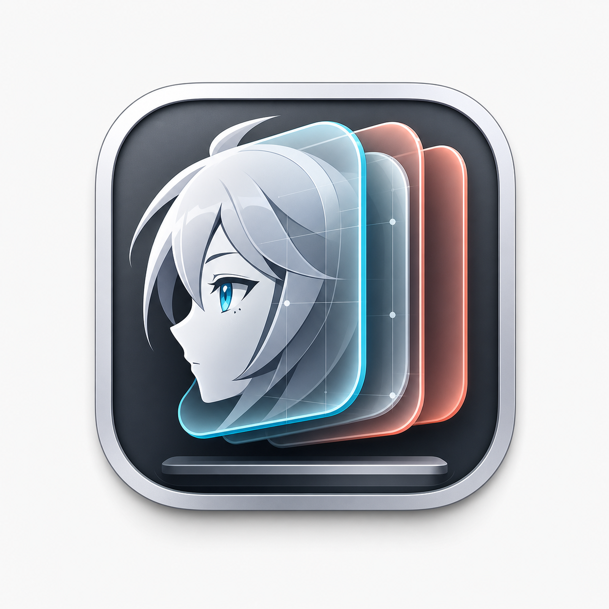

# MacAvatarLayer



A Rust-first macOS Live2D avatar host. This README is intentionally focused on the shortest path for users who want to compile and run the app locally.

For architecture notes, advanced commands, OBS/capture details, configuration reference, tests, and contributor workflows, read [DEVELOPER.md](DEVELOPER.md).

## Requirements

- macOS.
- Rust toolchain with `cargo`.
- Xcode Command Line Tools. Install them if needed:

```bash
xcode-select --install
```

- Live2D Cubism SDK for Native installed locally. Download it from
  [Live2D Cubism SDK](https://www.live2d.com/en/sdk/about/) by choosing
  `Cubism SDK for Native`. The project does not commit or automatically
  download the SDK.
- A local Live2D model, usually selected as `public/model/0.model3.json`.

Note: Live2D's official SDK page lists the official `Cubism SDK for Native`
sample renderer support matrix. It does not provide a macOS Metal sample
renderer there. MacAvatarLayer still runs on macOS with Metal because this
project uses Cubism Core for model evaluation and implements its own Rust/Metal
renderer instead of using Live2D's sample renderer.

## Local Asset Layout

`public/` is intentionally local-only and ignored by Git. Do not commit official Live2D SDK files or model assets.

Default model layout:

```text
public/
  model/
    0.model3.json
    0.moc3
    0.physics3.json
    0.cdi3.json
    0.8192/
      texture_00.png
      texture_01.png
```

Default SDK layout:

```text
public/
  CubismSdkForNative/
    Core/
      include/
        Live2DCubismCore.h
      lib/
        macos/
          arm64/
            libLive2DCubismCore.a
          x86_64/
            libLive2DCubismCore.a
```

You can also point to the SDK with environment variables instead of using `public/CubismSdkForNative`:

```bash
LIVE2D_CUBISM_SDK_NATIVE_DIR=/path/to/CubismSdkForNative
CUBISM_CORE_INCLUDE_DIR=/path/to/Core/include
CUBISM_CORE_LIB_DIR=/path/to/Core/lib/macos/arm64
```

No project command downloads the Live2D SDK. `cargo xtask start`,
`cargo xtask run-metal`, and `cargo xtask doctor` only detect local SDK paths
and print repair instructions when files are missing.

## Quick Start

From the repository root:

```bash
cargo xtask doctor
cargo xtask start
```

`cargo xtask doctor` checks local configs, the selected model, Cubism Core SDK files, and app camera/microphone entitlements.

`cargo xtask start` is the short normal-user command. It is equivalent to:

```bash
cargo xtask run-metal --release
```

With no model argument, `start` uses `[model].path` from `mac-avatar-layer.build.toml`, falling back to `public/model/0.model3.json` when unset. It auto-detects the local Cubism SDK, sets `CUBISM_CORE_LIB_DIR` and `CUBISM_CORE_INCLUDE_DIR`, closes old `mac-avatar-layer` instances, builds the optimized local app, signs it ad-hoc if no Apple developer certificate is available, and launches through the stable local `.app` wrapper.

## Choose A Model

List local models:

```bash
cargo xtask list-models
```

Persist a model for normal `start` runs:

```bash
cargo xtask select-model --build public/model/0.model3.json
cargo xtask start
```

Start a model for one run without changing the config:

```bash
cargo xtask start public/model/0.model3.json
```

## Permissions

Camera permission is requested by the local app wrapper when `[input.camera].enabled = true` in the active config. If macOS asks, allow `MacAvatarLayer Dev`, then restart:

```bash
cargo xtask start
```

If a previous denial is cached, reset only this app identity:

```bash
tccutil reset Camera io.github.symphonyiceattack.mac-avatar-layer
cargo xtask start
```

Microphone permission is only needed when microphone input is enabled. If startup reports a microphone failure, allow the launching terminal/app under macOS System Settings > Privacy & Security > Microphone, or disable microphone input in the active config.

## Useful Commands

```bash
cargo xtask doctor
cargo xtask start
cargo xtask start public/model/0.model3.json
cargo xtask list-models
cargo xtask select-model --build public/model/0.model3.json
cargo xtask run-metal        # development profile
cargo xtask run-metal --release
cargo xtask build-app --release
```

## Troubleshooting

If `doctor` or `start` reports missing `Live2DCubismCore.h`, install
[Live2D Cubism SDK for Native](https://www.live2d.com/en/sdk/about/) locally or
set `LIVE2D_CUBISM_SDK_NATIVE_DIR` / `CUBISM_CORE_INCLUDE_DIR`.

If it reports missing `libLive2DCubismCore.a`, check `CUBISM_CORE_LIB_DIR` or make sure the SDK has the matching macOS library for your architecture.

If the selected model is missing, run:

```bash
cargo xtask list-models
cargo xtask select-model --build MODEL_PATH
cargo xtask start
```

The normal desktop-window workflow does not require an Apple Developer Program account or developer signing certificate. The System Camera Source / Camera Extension prototype is separate and still requires Apple Developer Program provisioning; see [DEVELOPER.md](DEVELOPER.md).
